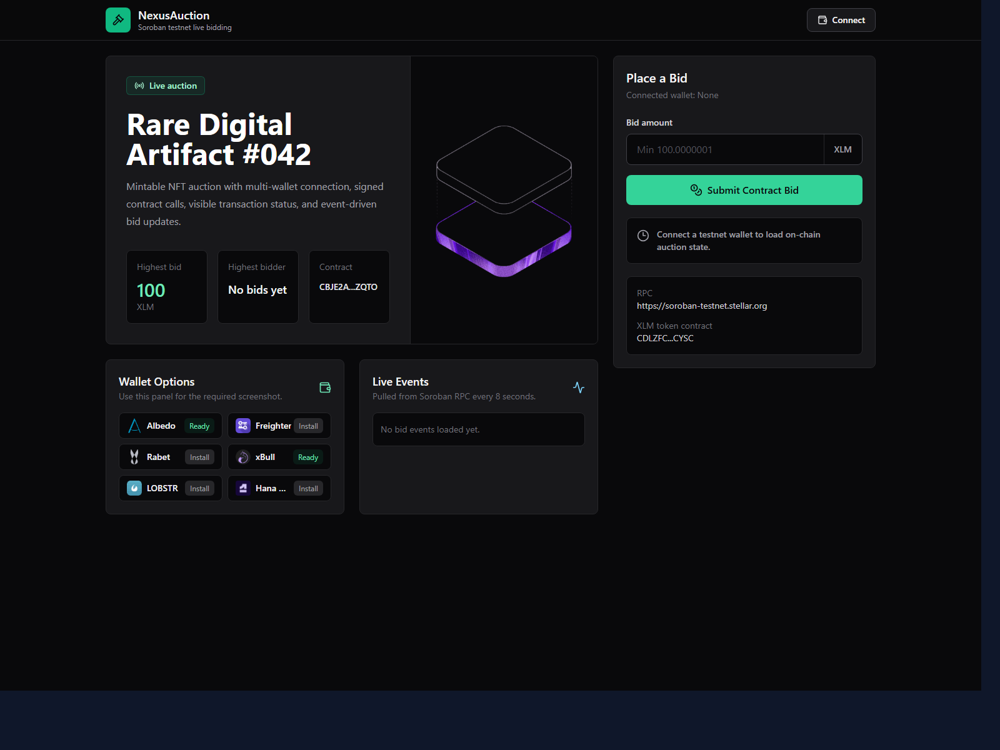
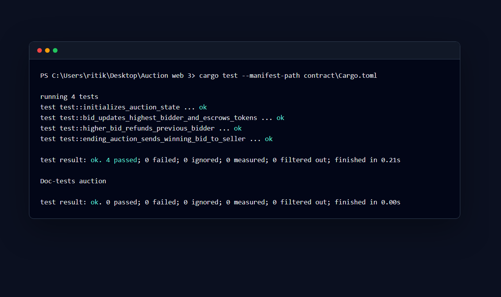

# NexusAuction

NFT Minter - Real-time Auction - Live bidding with Soroban event updates.

This is a Level 2 Stellar dApp submission with multi-wallet support, a deployed Soroban testnet contract, frontend contract calls, transaction status tracking, and live event synchronization.

## Level 2 Checklist

- [x] StellarWalletsKit multi-wallet integration
- [x] 3 error types handled: wallet not found, wallet rejected, insufficient balance
- [x] Contract deployed on testnet
- [x] Contract called from the frontend
- [x] Reads and writes auction data through the contract
- [x] Transaction status visible: pending, success, fail
- [x] Real-time event polling and state synchronization
- [x] Minimum 3+ meaningful commits
- [x] Test screenshot showing 3+ tests passing
- [x] 1-minute demo video

## Deployed Contract

- Testnet contract address: `CBJE2A4DFK7ZI3KPD2BHYPURDXKYP7XNUIVBM6DLWIXSNOTKC37KZQTO`
- Contract call transaction hash: `5f85ea7c31faeda538ce326b8f3dc7a1c4734e07fae9ec6289f598c6d0f3fcca`
- Upload WASM transaction hash: `dacc8caf50d8efc3ade88ea7d9411e6dedb80c5e0939bca563d7eee06dd26cf5`
- Create contract transaction hash: `6d2ae4dbdd2dacc5a2ea28efe8f93f9baa56b0adbdc5d52514b7aaba9bc9a456`
- Explorer: https://stellar.expert/explorer/testnet/contract/CBJE2A4DFK7ZI3KPD2BHYPURDXKYP7XNUIVBM6DLWIXSNOTKC37KZQTO

## Screenshot

Wallet options available:



Test output showing 3+ tests passing:



## Setup

Prerequisites:

- Node.js 18+
- Rust with `wasm32v1-none` target
- A Stellar testnet wallet such as Freighter, Albedo, Rabet, xBull, LOBSTR, or Hana
- Testnet XLM for bidding and fees

Install and run the frontend:

```bash
cd frontend
npm install
npm run dev
```

Build the frontend:

```bash
cd frontend
npm run build
```

Build the contract WASM:

```bash
cargo build --target wasm32v1-none --release --manifest-path contract/Cargo.toml
```

Deploy a fresh testnet contract:

```bash
cd frontend
npm run deploy:contract
```

The app uses the deployed contract above by default. To use another deployment, set:

```bash
VITE_AUCTION_CONTRACT_ID=YOUR_CONTRACT_ID
```

## Live Demo

Live app: https://nexus-auction.vercel.app/

Demo video: https://drive.google.com/file/d/1SDKdj2_L2yVju-SCtBJbqnpY35KNieI-/view?usp=sharing

This repository includes `vercel.json`, so Vercel can deploy from the repo root and publish `frontend/dist`.

If configuring Vercel manually, use:

- Install command: `cd frontend && npm install`
- Build command: `cd frontend && npm run build`
- Output directory: `frontend/dist`
